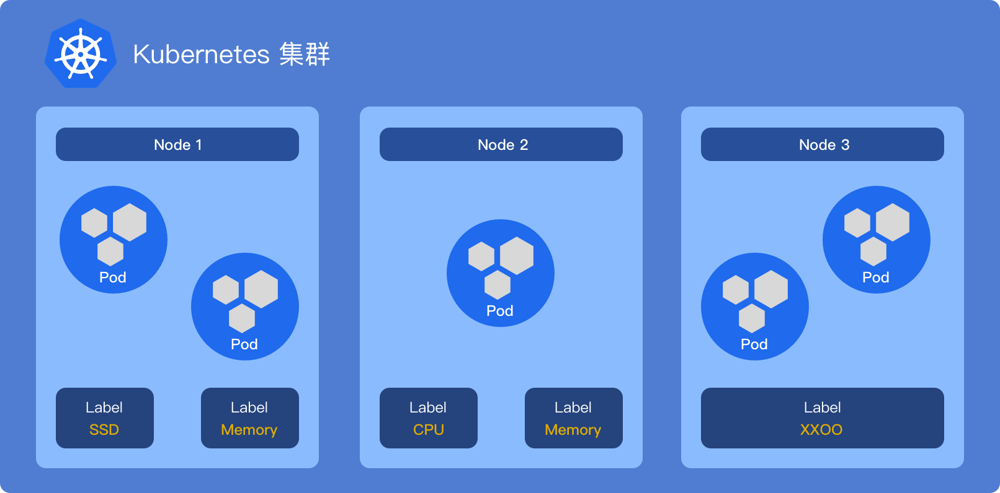

## nodeSelector

该方式是节点选择约束最简单的方式，只需要节点配置标签，就能完成绑定。



示例YAML

```yaml
# node-selector.yaml
 
apiVersion: v1
kind: Pod
metadata:
  name: node-selector-test-1
  namespace: viest
spec:
  containers:
  - name: test-nginx-1
    image: nginx
    ports:
    - containerPort: 80
  nodeSelector:
    CPU: "68"
```

部署Pod

```bash
kubectl apply -f node-selector.yaml
```

查看Pod信息

```bash
kubectl describe pod node-selector-test-1 -n viest
 
Name:         node-selector-test-1
Namespace:    viest
Priority:     0
Node:         kubernetes-node-2/192.168.199.36
Start Time:   Fri, 10 Jul 2020 09:28:41 +0000
Labels:       <none>
Annotations:  Status:  Running
IP:           10.244.2.10
```

可以看到节点自动落在了带有 `CPU=68` 标签的 `kubernetes-node-2` 节点上，即便是服务更新、删除重建，服务始终落在拥有 `CPU=68` 的节点上。

## nodeAffinity

与 `nodeSelector` 一样约束条件是`node label` ，但比 `nodeSelector`的 `==` ，`nodeAffinity` 能够更加精细的控制 `Pod` 调度，可用的操作符：`In`、`NotIn`、 `Gt`、 `Lt`、 `Exists`、 `DoesNotExist` 。

调度匹配模式可以分为两种，分别为 `requiredDuringSchedulingIgnoredDuringExecution（硬策略）` 和 `preferredDuringSchedulingIgnoredDuringExecution（软策略）`，**硬策略比较轴**，如果节点位于不可用区域，就会不断重试，直到约束条件满足为止；相反 **软策略同情达理** 不少，优先寻址符合条件的节点，如果节点位于不可用区域时，则允许调度至约束条件以外的其它节点上。

**注意：**Pod完成后，更改节点`label`，Pod并不会自动漂移至新节点；如果想让Pod跟随`label`漂移，可以查下方的`podAffinity`。

> 条件匹配除了 `matchExpressions` 还有一个 `nodeSelectorTerms`，我们可以把它们看作 `and` 和 `or`。
>
> `matchExpressions` 多个条件同时满足；
>
> `nodeSelectorTerms` 多个条件，任意一个满足即可；

硬策略示例YAML，强制部署在拥有在 `CPU:68` 这个 `Label` 的节点上：

```yaml
# node-affinity.yaml
 
apiVersion: v1
kind: Pod
metadata:
  name: node-affinity-test-1
  namespace: viest
spec:
  containers:
  - name: test-nginx-1
    image: nginx
    ports:
    - containerPort: 80
  affinity:
    nodeAffinity:
      requiredDuringSchedulingIgnoredDuringExecution:
        nodeSelectorTerms:
        - matchExpressions:
          - key: CPU
            operator: In
            values:
            - "68"
```

查看 Pod 信息

```bash
kubectl describe pod node-affinity-test-1 -n viest
 
Name:         node-affinity-test-1
Namespace:    viest
Priority:     0
Node:         kubernetes-node-2/192.168.199.36
Start Time:   Mon, 13 Jul 2020 08:38:23 +0000
Labels:       <none>
Annotations:  Status:  Running
IP:           10.244.2.11
```

Pod严格按照硬策略部署在了 `kubernetes-node-2` 节点上，下面我们将尝试将`values` 改为一个不存在的值 `70`。

```
Name:         node-affinity-test-1
Namespace:    viest
Priority:     0
Node:         <none>
Labels:       <none>
Annotations:  Status:  Pending
IP:
IPs:          <none>
Events:
  Type     Reason            Age        From               Message
  ----     ------            ----       ----               -------
  Warning  FailedScheduling  <unknown>  default-scheduler  0/3 nodes are available: 3 node(s) didn't match node selector.
  Warning  FailedScheduling  <unknown>  default-scheduler  0/3 nodes are available: 3 node(s) didn't match node selector.
```

Pod状态一直为 `Pending`，事件日志明确告诉我们没有找到一个节点符合约束条件；现在我们尝试为 `kubernetes-node-1` 节点打上 `CPU=70` 的标签。

```
Events:
  Type     Reason            Age        From               Message
  ----     ------            ----       ----               -------
  Warning  FailedScheduling  <unknown>  default-scheduler  0/3 nodes are available: 3 node(s) didn't match node selector.
  Warning  FailedScheduling  <unknown>  default-scheduler  0/3 nodes are available: 3 node(s) didn't match node selector.
  Normal   Scheduled         <unknown>  default-scheduler  Successfully assigned viest/node-affinity-test-1 to kubernetes-node-1
```

再查看Pod事件信息，调度器已将Pod分配给了拥有`CPU=70` 标签的 `kubernetes-node-1` 节点，由此可以验证上面描述的，在`硬策略`下未满足约束条件时，将会不断重试，直到满足条件为止。

知道了 `硬策略` 的调度套路，再来看下 `软策略` ，也是创建一个示例 Pod。

```yaml
# node-affinity-2.yaml
 
apiVersion: v1
kind: Pod
metadata:
  name: node-affinity-test-2
  namespace: viest
spec:
  containers:
  - name: test-nginx-2
    image: nginx
    ports:
    - containerPort: 80
  affinity:
    nodeAffinity:
      preferredDuringSchedulingIgnoredDuringExecution:
      - weight: 1
        preference:
          matchExpressions:
          - key: CPU
            operator: In
            values:
            - "50"
```

集群中并没有一个节点持有 `CPU=50` 这个标签，但是Pod依旧部署成功了。

```bash
kubectl apply -f node-affinity-2.yaml
 
pod/node-affinity-test-2 created
```

再次修改yaml文件，将约束条件改为 `CPU=68` 后尝试部署

```bash
kubectl apply -f node-affinity-2.yaml
 
Events:
  Type    Reason     Age        From                        Message
  ----    ------     ----       ----                        -------
  Normal  Scheduled  <unknown>  default-scheduler           Successfully assigned viest/node-affinity-test-2 to kubernetes-node-2
  Normal  Pulling    94s        kubelet, kubernetes-node-2  Pulling image "nginx"
  Normal  Pulled     83s        kubelet, kubernetes-node-2  Successfully pulled image "nginx"
  Normal  Created    82s        kubelet, kubernetes-node-2  Created container test-nginx-2
  Normal  Started    82s        kubelet, kubernetes-node-2  Started container test-nginx-2
```

Pod 准确的落在了 `kubernetes-node-2` 节点上，由此可以验证上面的描述，在 `软策略` 下 **优先** 匹配符合约束条件的节点，如果没有一个节点可用，由kubernetes调度至其它节点上。

## podAffinity

前面我们了解的`nodeSelector` 和 `nodeAffinity` 可以让Pod合理的选择节点，但是如果想进一步编排Pod，就需要引入一个新知识 `podAffinity`，它和 `nodeAffinity` 十分相似，也存在`requiredDuringSchedulingIgnoredDuringExecution（硬策略）` 和 `preferredDuringSchedulingIgnoredDuringExecution（软策略）` 调度匹配模式，唯一的区别是 `podAffinity` 可以匹配该节点上已有Pod的 `label` 元数据，通过此特性就可以把两个或多个服务部署在同一个区域 或 同一个节点，以此减小服务间通信消耗。

部署前，先为节点创建`label`，以此在节点中划分区域，实际生产中，你可以依据可用区划分区域。

```bash
kubectl label node kubernetes-node-1 topology.kubernetes.io/zone=one
kubectl label node kubernetes-node-2 topology.kubernetes.io/zone=two
```

查看现在的节点`label`

```
kubectl get nodes --show-labels
 
NAME                STATUS   ROLES    AGE   VERSION   LABELS
kubernetes-master   Ready    master   34d   v1.18.3   beta.kubernetes.io/arch=amd64,beta.kubernetes.io/os=linux,kubernetes.io/arch=amd64,kubernetes.io/hostname=kubernetes-master,kubernetes.io/os=linux,node-role.kubernetes.io/master=
kubernetes-node-1   Ready    <none>   33d   v1.18.3   CPU=70,beta.kubernetes.io/arch=amd64,beta.kubernetes.io/os=linux,kubernetes.io/arch=amd64,kubernetes.io/hostname=kubernetes-node-1,kubernetes.io/os=linux,topology.kubernetes.io/zone=one
kubernetes-node-2   Ready    <none>   34d   v1.18.3   CPU=68,beta.kubernetes.io/arch=amd64,beta.kubernetes.io/os=linux,kubernetes.io/arch=amd64,kubernetes.io/hostname=kubernetes-node-2,kubernetes.io/os=linux,topology.kubernetes.io/zone=two
```

在部署一个 `one` 可用区部署一个服务 `pod-affinity-one-origin`

```yaml
# pod-affinity-one-origin.yaml
 
apiVersion: v1
kind: Pod
metadata:
  name: pod-affinity-one-test-origin
  namespace: viest
  labels:
    env: produce
spec:
  containers:
  - name: test-affinity-nginx-origin
    image: nginx
    ports:
    - containerPort: 80
  affinity:
    nodeAffinity:
      requiredDuringSchedulingIgnoredDuringExecution:
        nodeSelectorTerms:
        - matchExpressions:
          - key: CPU
            operator: In
            values:
            - "70"
```

现在再来部署`Pod亲和`服务，我们希望这个服务也在 `one` 可用区，同时 `one` 可用区内必须存在一个 `Pod label` 为 `env=produce` 的服务，否则将部署失败。

```yaml
# pod-affinity-test-1.yaml
 
apiVersion: v1
kind: Pod
metadata:
  name: pod-affinity-test-1
  namespace: viest
  labels:
    env: produce
spec:
  containers:
  - name: test-affinity-nginx-origin
    image: nginx
    ports:
    - containerPort: 80
  affinity:
    podAffinity:
      requiredDuringSchedulingIgnoredDuringExecution:
      - topologyKey: topology.kubernetes.io/zone
        labelSelector:
          matchExpressions:
          - key: env
            operator: In
            values:
            - "produce"
```

目前集群内仅 `node-1` 节点处于 `one` 可用区内，且至少有一个`Pod pod-affinity-one-test-origin` 拥有 `env=produce` 标签，所以 `pod-affinity-test-1` 最终将会部署在 `node-1` 节点上。

```
Events:
  Type    Reason     Age        From                        Message
  ----    ------     ----       ----                        -------
  Normal  Scheduled  <unknown>  default-scheduler           Successfully assigned viest/pod-affinity-test-1 to kubernetes-node-1
  Normal  Pulling    20s        kubelet, kubernetes-node-1  Pulling image "nginx"
  Normal  Pulled     1s         kubelet, kubernetes-node-1  Successfully pulled image "nginx"
  Normal  Created    1s         kubelet, kubernetes-node-1  Created container test-affinity-nginx-origin
  Normal  Started    1s         kubelet, kubernetes-node-1  Started container test-affinity-nginx-origin
```

## podAntiAffinity

`podAntiAffinity` 与 `podAffinity` 相反，`podAffinity` 希望与某某Pod就近部署，`podAntiAffinity` 则不希望与某某Pod就近部署。

示例中Pod希望 `node label topology.kubernetes.io/zone` 内没有 `pod label env=produce`，即使没有其它可用区可用，也允许部署在`one`可用区（软策略）。

```yaml
# pod-anti-affinity-test-1.yaml
 
apiVersion: v1
kind: Pod
metadata:
  name: pod-anti-affinity-test-1
  namespace: viest
  labels:
    env: test
spec:
  containers:
  - name: test-anti-affinity-nginx-1
    image: nginx
    ports:
    - containerPort: 80
  affinity:
    podAntiAffinity:
      preferredDuringSchedulingIgnoredDuringExecution:
      - weight: 1
        podAffinityTerm:
          topologyKey: topology.kubernetes.io/zone
          labelSelector:
            matchExpressions:
            - key: env
              operator: In
              values:
              - "produce"
```

由于 `one` 可用区内存在与`label`条件相匹配的Pod，所以Pod被部署至 `two` 可用区

```
Events:
  Type    Reason     Age        From                        Message
  ----    ------     ----       ----                        -------
  Normal  Scheduled  <unknown>  default-scheduler           Successfully assigned viest/pod-anti-affinity-test-1 to kubernetes-node-2
  Normal  Pulling    17s        kubelet, kubernetes-node-2  Pulling image "nginx"
  Normal  Pulled     5s         kubelet, kubernetes-node-2  Successfully pulled image "nginx"
  Normal  Created    5s         kubelet, kubernetes-node-2  Created container test-anti-affinity-nginx-1
  Normal  Started    5s         kubelet, kubernetes-node-2  Started container test-anti-affinity-nginx-1
```

这时将Pod删除，然后将`node-2`的`zone`也改为`one`

```bash
kubectl label node kubernetes-node-2 topology.kubernetes.io/zone=one --overwrite
```

再部署Pod时，由于软策略的特性，并没有处于等待状态，反而部署成功。