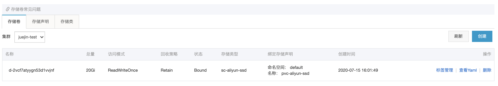
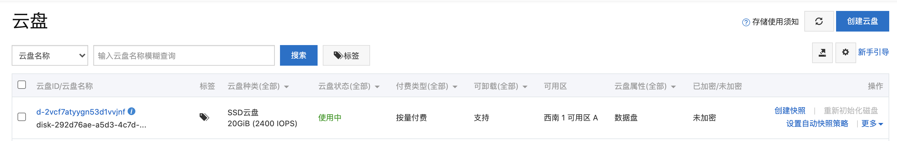

# 持久化存储

## Secrets

`secret` 允许存储`base64`编码、字符串，其中字符串可以不用对数据进行`base64`，可以用于存储【机密】数据，将配置与业务容器解耦。存储类型：第三方服务证书、密钥等机密数据。

示例YAML：`examples.yaml`

```yaml
apiVersion: v1
kind: Secret
metadata:
  name: examples
  namespace: default
type: Opaque
# Base64编码
data:
  key: dmFsdWUK
# 明文字符
stringData:
  auth: "viest"
  # 文件形式
  examples.yaml: |-
    key: value
```

创建 `Secrets`

```bash
kubectl apply -f examples.yaml
```

查看 `Secrets` 列表

```bash
kubectl get secrets -n viest
```

查看 `Secrets` 详情

```bash
kubectl describe secrets examples -n viest
```

## ConfigMaps (cm)

与`secret`作用类似，但是它们的差别在于 `ComfigMap` 用于存储非【机密】数据。

示例 YAML：`examples.yaml`

```yaml
apiVersion: v1
kind: ConfigMap
metadata:
  name: examples
  namespace: viest
data:
  # KV形式
  REDIS_HOST: "redis-host"
  REDIS_PORT: "6379"
  REDIS_PASSWORD: "abcdefg"
  # 文件形式
  examples.conf: |-
    protocol http
```

创建 `ConfigMaps`

```bash
kubectl apply -f examples.yaml
```

查看 `ConfigMap` 列表

```bash
kubectl get cm -n viest
```

查看 `ConfigMap` 详情

```bash
kubectl describe cm examples -n viest
```

## PersistentVolume (pv)

`持久存储卷`由管理员配置、创建，且生命周期与挂载它的Pod无关。它是对共享存储层的一种抽象，比如NFS或公有云服务商存储系统均通过插件的形式与之完成对接。

存储卷生命周期中有四个状态：

1. Available（可用）：存储卷可用，还未被 PVC 绑定；
2. Bound（绑定）：存储卷可用，已经被 PVC 绑定；
3. Released（释放）：存储卷不可用，PVC 被删除，但是资源还未被重新声明；
4. Failed（失败）： 存储卷不可用，自动回收失败；

### 云存储卷

示例 YAML：`examples-cloud.yaml` ，云服务商：阿里云NAS。

```yaml
# pv-aliyun-nas.yaml
 
apiVersion: v1
kind: PersistentVolume
metadata:
  name: pv-aliyun-nas
spec:
  # 存储设置，目前唯一可以设置的属性只有空间大小
  capacity:
    storage: 5Gi
  # StorageClass名称，如果PV设置了SC，请求该PV的PVC也必须设置SC，否则将绑定失败
  storageClassName: nas
  # 访问模式 ReadWriteMany，可以被多个节点以读写方式安装本卷
  accessModes:
    - ReadWriteMany
  # 回收策略
  # persistentVolumeReclaimPolicy: Retain
  # 底层存储插件，通过插件挂载阿里云NAS
  flexVolume:
    driver: "alicloud/nas"
    options:
      server: "balabala.cn-hangzhou.nas.aliyuncs.com"
      path: "/k8s/viest"
      vers: "3"
      options: "nolock,tcp,noresvport"
```

### 本地存储卷

示例 YAML：`examples-local.yaml`，后面 PVC 章节，我们也将挂载本地存储卷作为实验存储。

```yaml
# pv-local.yaml
 
apiVersion: v1
kind: PersistentVolume
metadata:
  name: pv-local
spec:
  # 存储设置，存储卷空间大小
  capacity:
    storage: 1Gi
  # 本地路径
  local:
    path: /home/ubuntu/kubernetes/pv/storage
  # 访问模式
  accessModes:
    - ReadWriteOnce
  # 回收策略
  persistentVolumeReclaimPolicy: Retain
  # 节点亲和性
  nodeAffinity:
    required:
      nodeSelectorTerms:
      - matchExpressions:
        - key: kubernetes.io/hostname
          operator: In
          values:
          - kubernetes-node-1
```

创建本地存储卷

```bash
kubectl apply -f pv-local.yaml
```

查看存储卷列表，状态为 `Available` ，说明存储卷已创建成功，等待被 PVC 消费。

```bash
kubectl get pv -n viest
 
NAME       CAPACITY   ACCESS MODES   RECLAIM POLICY   STATUS      CLAIM   STORAGECLASS   REASON   AGE
pv-local   1Gi        RWO            Retain           Available                                   17m
```

查看存储卷状态

```bash
kubectl describe pv-local -n viest
```

### 补充

除了示例文件中的配置项，还有几个不常用但需要注意的配置项：

#### 1. 回收策略 persistentVolumeReclaimPolicy

PV 支持的策略有以下三种：

1. Retain：保留数据，需要管理员人工删除数据；
2. Recycle：删除数据，回收存储空间，效果相当于执行 `rm -rf /k8s/viest/*`；
3. Delete：删除数据，删除实体存储空间，与PV关联的后端存储资源将被删除，比如 阿里云 NAS；

当前仅NFS和HostPath支持回收。

#### 2. 卷模式 volumeMode

卷模式是可选参数，默认值是 `Filesystem`。用户可以指定 volumeMode 为 `Block` 以支持原始块设备。

#### 3. 节点绑定 nodeAffinity

如果你创建的是本地存储卷（nodeAffinity 将是必填项，反之则为可选项），则需要告诉 kubernetes 调度程序，将 PV 绑定至集群內特定节点。

```yaml
# spec.nodeAffinity
  nodeAffinity:
    required:
      nodeSelectorTerms:
      - matchExpressions:
        - key: kubernetes.io/hostname
          operator: In
          values:
          - kubernetes-node-1
```

## PersistentVolumeClaims (pvc)

`持久存储卷声明`由用户配置、创建，用户通过 PVC 消耗 PV 资源，PVC 声明了存储空间（PV）和访问模式。

看到下面示例 YAML, 有的童鞋可能会好奇，PVC 中并没有声明需要绑定的 PV，kubernetes 怎么判断用户想绑定哪个存储卷。其实在 PVC 创建时，kubernetes 先在集群中寻找状态为 `Available` 的存储卷，再根据请求存储空间大小匹配存储卷，未匹配到存储卷则PVC将一直处于 Pending 状态（PV空间小于PVC中声明的空间时无法绑定成功）。

### 自动匹配优先级

1. 存储卷空间大小相同；
2. 存储卷空间比请求空间大，且最接近请求空间大小（PVC 中声明的空间小于 PV 的空间大小，则会忽略 PVC 中声明的空间大小，以 PV 空间大小为主）；

```yaml
# pvc-local.yaml
 
apiVersion: v1
kind: PersistentVolumeClaim
metadata:
  name: pvc-local
  namespace: viest
spec:
  accessModes:
    - ReadWriteOnce
  resources:
    requests:
      storage: 1Gi
```

创建 PVC

```bash
kubectl apply -f pvc-local.yaml
```

查看 PV 状态，如果是 `Bound` 且对应的声明 `viest/pvc-local`，说明 PVC 和 PV 绑定成功。

```bash
kubectl get pv -n viest
 
NAME       CAPACITY   ACCESS MODES   RECLAIM POLICY   STATUS   CLAIM             STORAGECLASS   REASON   AGE
pv-local   1Gi        RWO            Retain           Bound    viest/pvc-local                           27m
```

### 手动匹配

除了让 kubernetes 自动筛选存储卷（PV），用户也可以通过匹配存储卷元数据中的 `label` 进行绑定。

```yaml
apiVersion: v1
kind: PersistentVolumeClaim
metadata:
  name: pvc-local-select-label
  namespace: viest
spec:
  accessModes:
    - ReadWriteOnce
  resources:
    requests:
      storage: 1Gi
  selector:
    matchLabels:
      env: test
```

但这里我们并不打算创建这个 PVC，感兴趣的童鞋可以在本地尝试创建。

### 使用存储卷

现在我们将通过 `pvc-local` 来使用前面创建的存储卷 `pv-local`，服务依旧是前面使用的 `Nginx`。

> 注意：Pod 与 PV 位于不同可用区，Pod 将无法完成部署，你将会收到 `1 node(s) had volume node affinity conflict` 错误信息。

```yaml
# pvc-pod.yaml
 
apiVersion: v1
kind: Pod
metadata:
  name: pvc-pod-test-1
  namespace: viest
  labels:
    app: pvc-test-1
spec:
  containers:
  - name: nginx
    image: nginx
    ports:
    - containerPort: 80
    volumeMounts:
    - name: html
      subPath: test-1-html
      mountPath: /usr/share/nginx/html
  volumes:
    - name: html
      persistentVolumeClaim:
        claimName: pvc-local
  nodeSelector:
    CPU: "70"
 
---
 
apiVersion: v1
kind: Service
metadata:
  name: pvc-pod-test-service
  namespace: viest
spec:
  type: NodePort
  ports:
  - port: 80
    targetPort: 80
  selector:
    app: pvc-test-1
```

创建 Pod 与 Service

```bash
kubectl apply -f pvc-pod.yaml
```

查看 Pod 与 Service

```bash
kubectl get all -n viest
 
NAME                 READY   STATUS    RESTARTS   AGE
pod/pvc-pod-test-1   1/1     Running   0          82s
 
NAME                           TYPE       CLUSTER-IP      EXTERNAL-IP   PORT(S)        AGE
service/pvc-pod-test-service   NodePort   10.96.136.161   <none>        80:30688/TCP   82s
```

第一次调用服务，此时存储卷中没有任何文件

```bash
curl 127.0.0.1:30688
 
<html>
<head><title>403 Forbidden</title></head>
<body>
<center><h1>403 Forbidden</h1></center>
<hr><center>nginx/1.19.1</center>
</body>
</html>
```

第二次调用服务，在存储卷中添加一个 `html` 文件

连接 `kubernetes-node-1` 节点，并在 `/home/ubuntu/kubernetes/pv/storage/test-1-html` 目录中创建一个html文件；可能细心的童鞋已经发现路径中出现了 `test-1-html` 目录，这个目录我们自始至终并没有创建过，这是容器挂载存储卷时根据 `subPath` 配置创建的，通过目录让容器存储资源隔离，即使多个容器挂载此存储卷也不会发送数据错乱。

```bash
echo '<html><body><h1>Hello Kubernetes PV</h1></body></html>' > index.html
```

访问服务，结果和预期一致，返回了我们刚刚创建的html文件。

```bash
curl 127.0.0.1:30688
 
<html><body><h1>Hello Kubernetes PV</h1></body></html>
```

## StorageClasses (sc)

`存储类型` 可以看作是 `持久存储卷` 配置，管理员可以预先配置多种 `存储类型`，用户根据自身需要使用不同的存储类型就可以动态创建不同类型的持久存储卷。

### 动态创建持久存储卷

管理员预先创建 `多种存储类型`，存储类型可以拥有不同的性能、回收策略、可用区。我们将在阿里云创建一个高性能SSD存储类型。

#### 创建 StorageClasses

```yaml
# sc-aliyun-ssd.yaml
 
apiVersion: storage.k8s.io/v1
kind: StorageClass
metadata:
  # 存储类型名称
  name: sc-aliyun-ssd
# 分配器插件，不同云服务商插件可能有差异，可以查看云服务商文档
provisioner: diskplugin.csi.alibabacloud.com
# 回收策略
reclaimPolicy: Retain
# 分配器插件参数
parameters:
  type: cloud_ssd
  fstype: "ext4"
  readonly: "false"
volumeBindingMode: WaitForFirstConsumer
```

创建存储类型

```bash
kubectl apply -f sc-aliyun-ssd.yaml
```

查存储类型

```bash
kubectl get sc
 
NAME                       PROVISIONER                       AGE
sc-aliyun-ssd              alicloud/disk                     5s
```

#### 创建存储卷声明

在阿里云拉起了一个临时集群，就先简单使用 `default` 命名空间。

```yaml
# pvc-aliyun-ssd.yaml
 
apiVersion: v1
kind: PersistentVolumeClaim
metadata:
  name: pvc-aliyun-ssd
  namespace: default
spec:
  # 存储类型名称
  storageClassName: sc-aliyun-ssd
  accessModes:
    - ReadWriteOnce
  # 阿里云PVC定义空间大小必须等于/大于 20G
  resources:
    requests:
      storage: 20Gi
```

创建 PVC

```bash
kubectl apply -f pvc-aliyun-ssd.yaml
```

查看 PVC

```bash
kubectl get pvc
 
NAME             STATUS    VOLUME   CAPACITY   ACCESS MODES   STORAGECLASS    AGE
pvc-aliyun-ssd   Pending                                      sc-aliyun-ssd   86s
```

#### 创建服务

```yaml
# sc-aliyun-ssd-pod.yaml
 
apiVersion: v1
kind: Pod
metadata:
  name: sc-aliyun-ssd-test-1
  namespace: default
  labels:
    app: sc-aliyun-ssd-test-1
spec:
  containers:
  - name: nginx
    image: nginx
    ports:
    - containerPort: 80
    volumeMounts:
    - name: aliyun-ssd
      subPath: ssd-test-1-html
      mountPath: /usr/share/nginx/html
  volumes:
    - name: aliyun-ssd
      persistentVolumeClaim:
        claimName: pvc-aliyun-ssd
```

创建服务

```bash
kubectl apply -f sc-aliyun-ssd-pod.yaml
```

#### 查看存储卷

进入阿里云kubernetes控制面板，查看存储卷是否已自动创建。



查看阿里云 `云盘` 是否已经自动创建



### 应用于传统存储卷

上面通过云服务商提供的分配器创建了一个存储卷动态分配类，如果是自建机房本地存储，无法使用云服务商提供的分配器，我们怎么将持久存储与存储类关联？

这里我们将创建一个本地存储卷，模拟自建本地存储，`PVC` 通过 `SC` 与存储卷关联，而不是通过 `selector label` 的方式。

#### 创建存储类

```yaml
# sc-local-ssd.yaml
 
apiVersion: storage.k8s.io/v1
kind: StorageClass
metadata:
  # 存储类型名称
  name: sc-ssd
# 不使用任何分配器
provisioner: kubernetes.io/no-provisioner
volumeBindingMode: WaitForFirstConsumer
reclaimPolicy: Retain
# 参数是可选配置项，可以为空
# 不同的分配器参数会可能有差异，详细参数以分配器文档为准
parameters:
```

创建存储类

```bash
kubectl apply -f sc-local-ssd.yaml
```

#### 创建持久存储卷

这里引用 PV 本地存储卷作为示例存储卷，在 `PV` 声明中使用 `storageClassName` 与存储类关联，当 Pod 绑定 PVC 时，SC 将会把已创建的存储卷与之关联。

```yaml
# pv-local-ssd.yaml
 
apiVersion: v1
kind: PersistentVolume
metadata:
  name: pv-local
  labels:
    storage: ssd
spec:
  # 存储设置，存储卷空间大小
  capacity:
    storage: 1Gi
  # 本地路径
  local:
    path: /home/ubuntu/kubernetes/pv/storage
  # 访问模式
  accessModes:
    - ReadWriteOnce
  # 回收策略
  persistentVolumeReclaimPolicy: Retain
  # 节点亲和性，将存储卷创建至本地存储机器上
  nodeAffinity:
    required:
      nodeSelectorTerms:
      - matchExpressions:
        - key: kubernetes.io/hostname
          operator: In
          values:
          - kubernetes-node-1
  storageClassName: sc-ssd
```

创建存储卷

```bash
kubectl apply -f pv-local-ssd.yaml
```

#### 创建存储卷声明

```yaml
# pvc-local-ssd.yaml
 
apiVersion: v1
kind: PersistentVolumeClaim
metadata:
  name: pvc-local-ssd
  namespace: viest
spec:
  # 存储类型名称
  storageClassName: sc-ssd
  accessModes:
    - ReadWriteOnce
  resources:
    requests:
      storage: 1Gi
```

#### 创建服务

```yaml
# sc-local-ssd-pod.yaml
 
apiVersion: v1
kind: Pod
metadata:
  name: sc-ssd-test-1
  namespace: viest
  labels:
    app: sc-ssd-test-1
spec:
  containers:
  - name: nginx
    image: nginx
    ports:
    - containerPort: 80
    volumeMounts:
    - name: local-ssd
      subPath: ssd-test-1-html
      mountPath: /usr/share/nginx/html
  volumes:
    - name: local-ssd
      persistentVolumeClaim:
        claimName: pvc-local-ssd
```

#### 查看存储卷声明

```bash
kubectl get pvc -n viest
 
NAME            STATUS   VOLUME       CAPACITY   ACCESS MODES   STORAGECLASS   AGE
pvc-local-ssd   Bound    pv-local     1Gi        RWO            sc-ssd         16m
```

可以看到 `PVC pvc-local-ssd` 与 `PV pv-local` 通过 `storageClasses sc-ssd` 成功绑定。